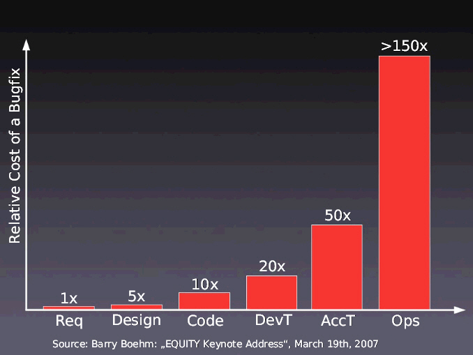

autoscale: true
<!---
This slidedeck designed for use with Deckset: http://www.decksetapp.com/
-->

# Intro to Testing

### Hashrocket TDD/Pair Programming Workshop

^
Team intro, class intro, Hashrocket intro, and agenda for the day

---

- Vim Chicago
- Hashrocket Event Horizon
- Ancient City Ruby (6-8 April)

---

# What is testing?

---

> test: n.
> 1. Real users bashing on a prototype long enough to get thoroughly acquainted
>    with it, with careful monitoring and followup of the results. 
--The Jargon File (ca. 1975)

---

# Kinds of Tests

---

# Kinds of Tests

- Unit
- Integration
- Validation & Verification
- Performance
- Usability
- Regression

---

# Pros & Cons

---

# Pros

- More resilient application
- Protection from regressions
- Documents behavior

> Test your software, or your users will.
--The Pragmatic Programmer

---

# Cost of Bugs

---

# Cons

- Slower development
- More difficult to write

---

# Popular Frameworks

---

# Popular Frameworks

- RSpec
- Cucumber
- MiniTest
- Capybara

---

# Questions?
